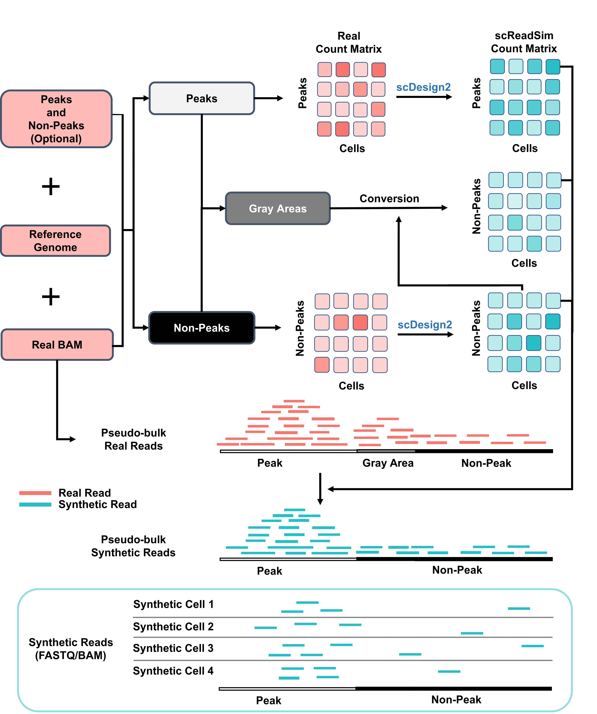
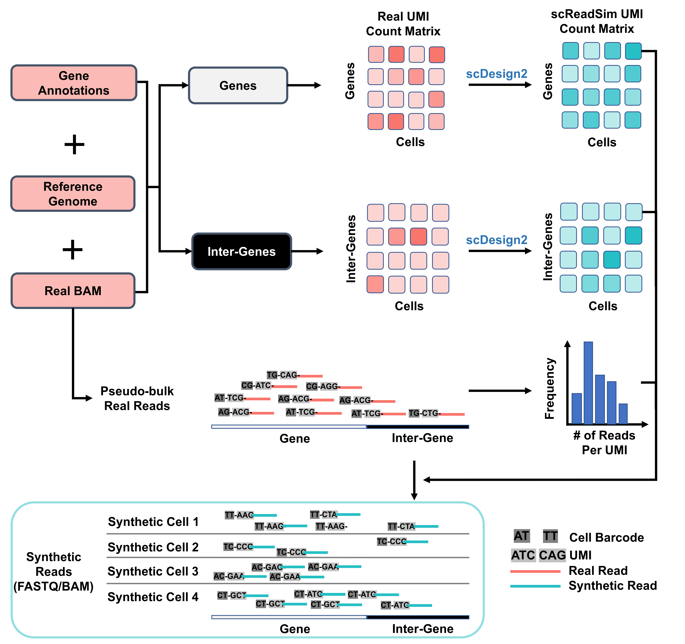

[](https://lbesson.mit-license.org/)
[](https://screadsim.readthedocs.io/en/latest/?badge=latest)

# **scReadSim**: a single-cell RNA-seq and ATAC-seq read simulator

scReadSim is a single-cell RNA-seq and ATAC-seq read simulator. It
starts from the BAM file of the input sequencing data and generates the
synthetic dataset using BAM or FASTQ formats. The synthetic data
generated by scReadSim resembles the real data in both the count and
read level.

## Workflow of scReadSim for generating scATAC-seq reads
```{r, echo=FALSE, fig.align='center', out.width="100%"}

```

## Workflow of scReadSim for generating scRNA-seq reads
```{r, echo=FALSE, fig.align='center', out.width="100%"}

```

## Installation

Install the latest version from
[GitHub](https://github.com/JSB-UCLA/scReadSim),

run:
```{bash, eval=FALSE}
    git clone https://github.com/JSB-UCLA/scReadSim.git
    pip install scReadSim --user
```
or:
```{bash, eval=FALSE}
    pip install git+https://github.com/JSB-UCLA/scReadSim.git
```
Or quick install from
[PyPI](https://pypi.org/project/scReadSim/1.4.1/#description):
```{bash, eval=FALSE}
    pip install scReadSim
```

## Overview
- [API](https://screadsim.readthedocs.io/en/latest/API.html)
- [About scReadSim](https://screadsim.readthedocs.io/en/latest/About%20scReadSim.html)


## Tutorials
- [Install required softwares of scReadSim](InstallTools)
- [scReadSim for 10x scATAC-seq](scATACseq_NoInput_10X)
- [scReadSim for 10x scRNA-seq](scRNAseq_10X)
- [scReadSim for single-cell multiomics](scMultiOmics)
- [scReadSim for scATAC-seq from multiple samples/conditions](scATACseq_MultiSamples)
- [scReadSim for scRNA-seq from multiple samples/conditions](scRNAseq_MultiSamples) 
- [scReadSim for scRNA-seq with condition effect](scRNAseq_10X_Condition)
- [scReadSim for 10x scRNA-seq (exon only)](scRNAseq_10X_ExonOnly)
- [scReadSim for 10x scATAC-seq with user-designed open chromatin regions](scATACseq_INPUT_10X)